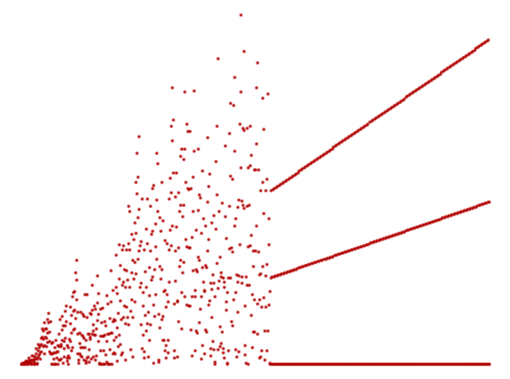
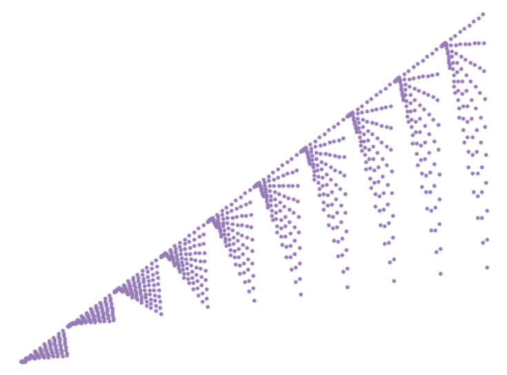
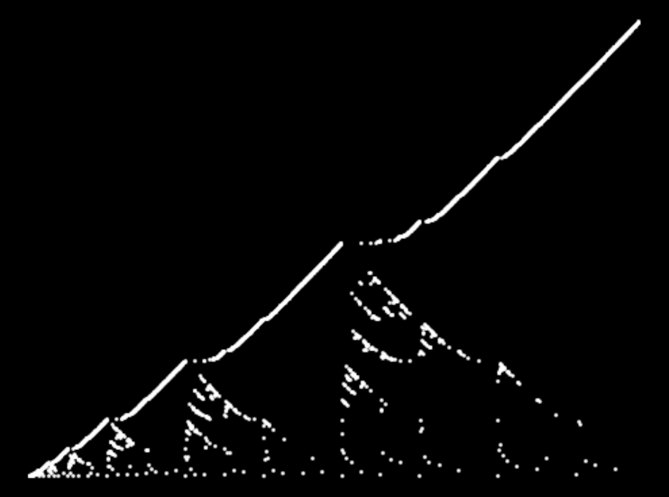
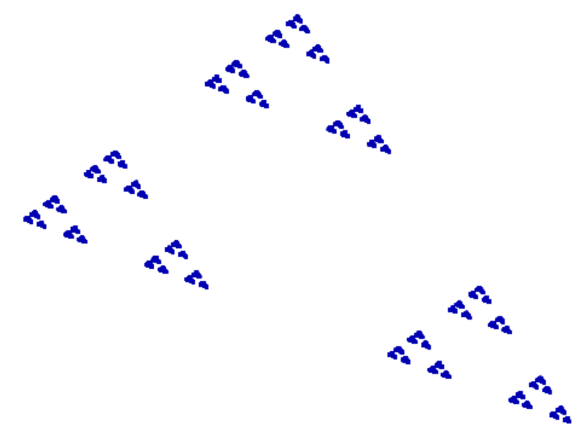
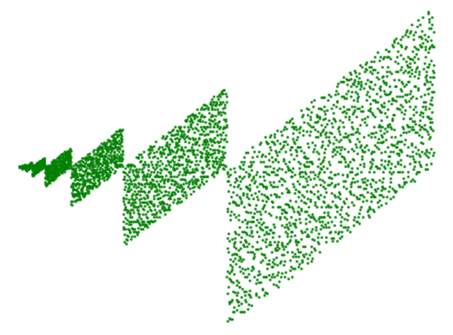
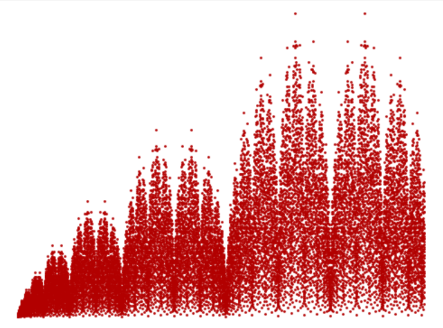
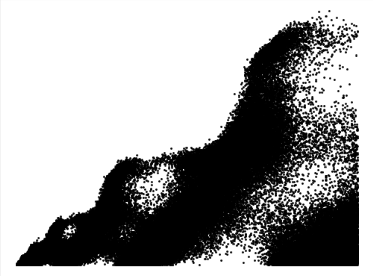
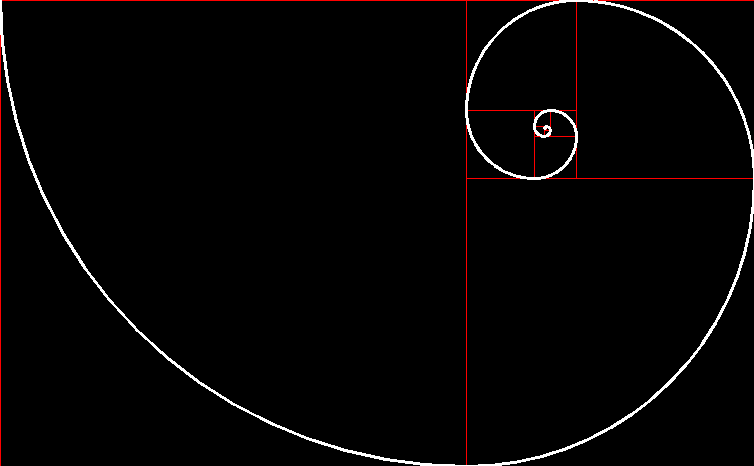

### Some math drawings using Python

<hr>

# About  
Some math drawings done in Python, using the OpenCV library, or Matplotlib for the [Amazing Graph](https://www.youtube.com/playlist?list=PLt5AfwLFPxWLkoPqhxvuA8183hh1rBnGM) series.   
Inside each folder you'll find all the images I have produced, as well as the source code to generate them yourself.  
Have fun tweaking the constant values!

Only made for fun.  

<sub>The _Trapped Knight_ was coded by a less-smart version of myself, therefore the code is pretty bad. I may or may not re-do it.</sub>

<hr>

# Sections

### [Drawings](#drawings-1)
### [Plots](#plots-1)

<hr>

# Plots
All these images were generated by plotting a scatter plot of an integer sequence with a pretty graph. These are all the sequences featured on the main videos of the [Amazing Graphs](https://www.youtube.com/playlist?list=PLt5AfwLFPxWLkoPqhxvuA8183hh1rBnGM) series by Neil Sloane on Numberphile. Make sure to check those videos, because they are amazing as well.  

## [Fly Straight, Dammit!](https://oeis.org/A133058)
Defined as:  
   ```a(0) = a(1) = 1; for n > 1, a(n) = a(n-1) + n + 1 if a(n-1) and n are coprime, otherwise a(n) = a(n-1)/gcd(a(n-1),n) (OEIS).```  

Seems to be a bit chaotic, but after something happens... the graph becomes 4 straight lines (2 are almost overlapped!)  



## [Wisteria](http://oeis.org/A299741)
I love this one because of how simple it is to generate, and how pretty it turns out.  
Defined as ```N - prod(N), where N is the index, and prod() is the product of its digits.``` So simple.  



## [Rémy Sigrist's Sequence](https://oeis.org/A279125)
This is my favourite image of all these plots, by far. The picture is astonishingly similar to a mountain landscape; it's just amazing.  
Defined as ```the lexicographically earliest sequence such that, for any distinct i and j, a(i)=a(j) implies (i AND j)=0 (where AND stands for the bitwise AND operator) (OEIS).```  



## [Balanced Ternary](https://oeis.org/A117966) (Star Wars)
I really like how this triforce-looking thing comes out of nowhere.  
Defined as the resulting integer if you change all 2s on the ternary representation of the index number with a -1 (for example, 14 is ```112```, so you write it as ```[1,1,-1]``` and compute it as ```1*3² + 1*3 + (-1) = 11```, therefore the 15th element in the sequence is an 11 (first index is 0)).  



## [Prime Parallelograms](https://oeis.org/A265326)
Another one with a super simple definition, this time even super easy to code and compute, and with a really neat graph.  
The definition is the shortest one of all these graphs: ```"n-th prime minus its binary reversal" (OEIS)```.  



## [Stern's Sequence](https://oeis.org/A002487) (Cathedrals)
This one is a bit fuzzy to code, but at least the graph is cool.  
Defined as what you get after doing this, if you read all the resulting rows, row by row:  
```
1 1  
1 (1+1) 1  
1 (1+2) 2 (2+1) 1  
1 (1+3) 3 (3+2) 2 (2+3) 3 (3+1) 1
...  
```  



## [Forest Fire](http://oeis.org/A229037)
This one is hard to compute, and the graph you get is a bit too populated and hard to appreciate. Check the one on [OEIS](http://oeis.org/A229037/graph) for a better picture.  

I really like the definition, because it is extremely easy to state, but not necessarily immediate to program efficiently. (In fact, I used a program listed in the OEIS to create this plot because mine was too slow).  
Defined as ```the secuence of positive integers where each is chosen to be as small as possible subject to the condition that no three terms a(j), a(j+k), a(j+2k) (for any j and k) form an arithmetic progression (OEIS).```  



## [Hofstadters' Sequence](https://oeis.org/A005185)
This one is maybe my least favourite one, because its definition is super messy, hard to follow, and the final image isn't too rewarding.  
Defined as this thing: ```a(n) = a(n-a(n-1)) + a(n-a(n-2)), with a(1)=1 and a(2)=1 initial conditions (OEIS).```  

For an interpretation of what that means, check the [video on Numberphile](https://youtu.be/j0o-pMIR8uk?t=128).  


# Drawings

Other drawings, using the OpenCV library to "paint on a canvas".

## Dragon Curve  
Read about this fractal [here](https://en.wikipedia.org/wiki/Dragon_curve) or watch [this Numberphile video](https://www.youtube.com/watch?v=wCyC-K_PnRY).  
Evidently, my favourite self-similar fractal, which I use as my profile picture for several websites, including GitHub.


## Trapped Knight
Learn more about this drawing on [this](https://www.youtube.com/watch?v=RGQe8waGJ4w) video featuring Neil Sloane.  


## Sierpinski Triangle constructed by chaos

Sierpinski Triangle constructed using something similar to [this](https://study.com/academy/lesson/the-sierpinski-triangle-the-chaos-game.html) method (changing the initial point from something within the triangle to just anywhere).  

Emerges from chaos. It's very interesting.


## Fibonacci Spiral
Maybe the simplest of them all, a traditional [Fibonacci Spiral](https://en.wikipedia.org/wiki/Golden_spiral).



## Mandelbrot Set
Get a minuscule taste of what this mind-baffling structure is all about [here](https://en.wikipedia.org/wiki/Mandelbrot_set).  
I didn't do this program all by myself, but I don't remember where I got the code from.


