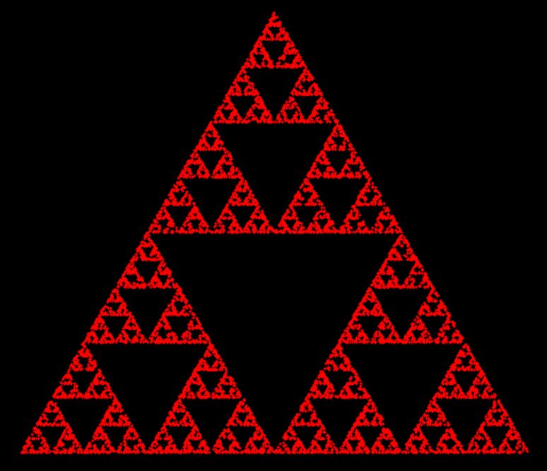
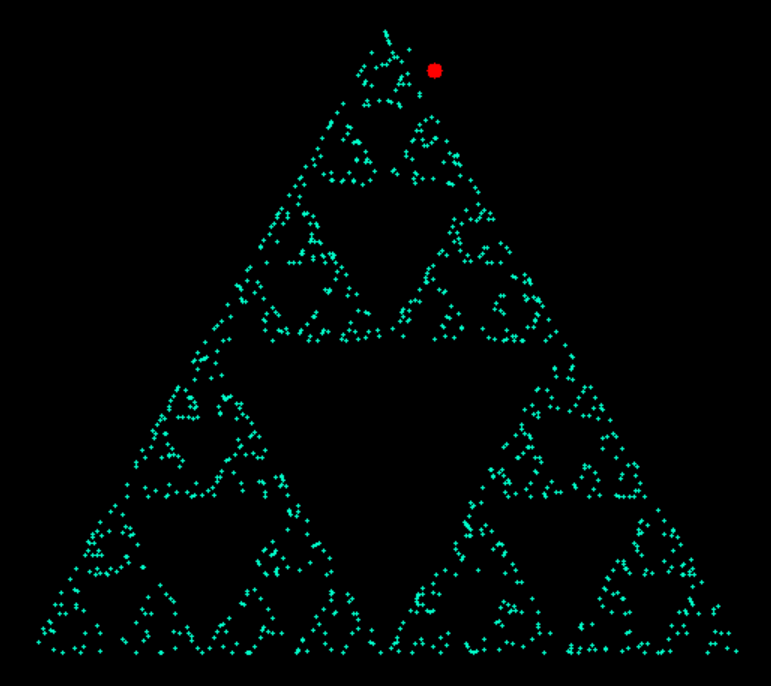
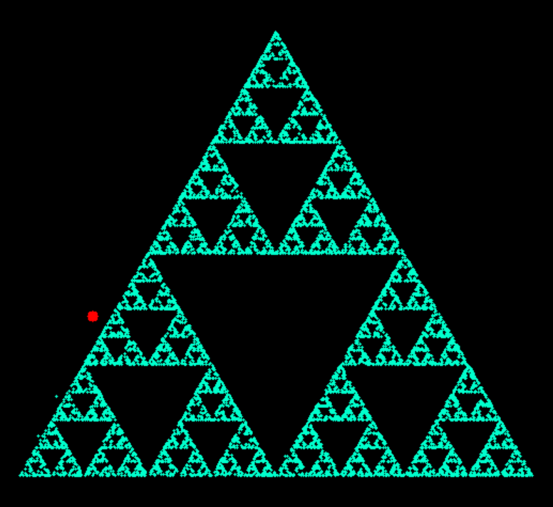

#### Some math drawings using Python

# About  
Some math drawings done in Python, using mostly the OpenCV library.  
Inside each folder you'll find all the images I have produced, as well as the source code to generate them yourself.  

_(Beware, it might be configured only to generate the last one or something like that, surely you'll have fun tweaking it!)_

Some of this programs are a bit outdated and coded by a less-wise version of myself, so they might be pretty bad. I'll try to make them better.

Only made for fun purposes.  

## Dragon Curve  
Read about this fractal [here](https://en.wikipedia.org/wiki/Dragon_curve) or watch [this Numberphile video](https://www.youtube.com/watch?v=wCyC-K_PnRY). Evidently my favourite and my profile picture for several websites, including GitHub.

## Trapped Knight
Learn more about this drawing on [this](https://www.youtube.com/watch?v=RGQe8waGJ4w) video featuring Neil Sloane.  

## Sierpinski Triangle constructed by chaos

Sierpinski Triangle constructed using something similar to [this](https://study.com/academy/lesson/the-sierpinski-triangle-the-chaos-game.html) method (changing the initial point from something within the triangle to just anywhere). Emerges from chaos. It's very interesting.

## Mandelbrot Set
Learn (a very little bit) about this mind-baffling structure [here](https://en.wikipedia.org/wiki/Mandelbrot_set).
I didn't do this program all by myself, but I don't remember where I got the code from.

## Fibonacci Spiral
The simplest of them all, a traditional Fibonacci Spiral.

