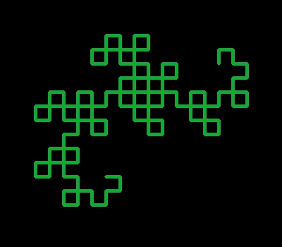
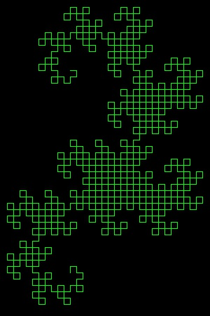
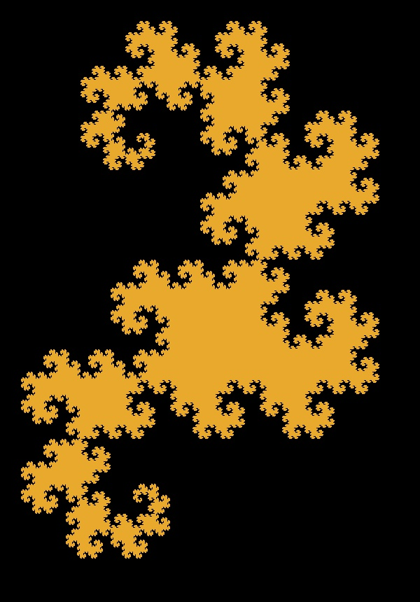
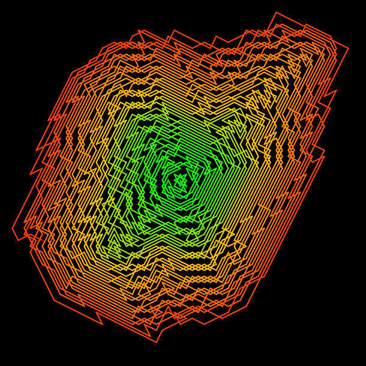
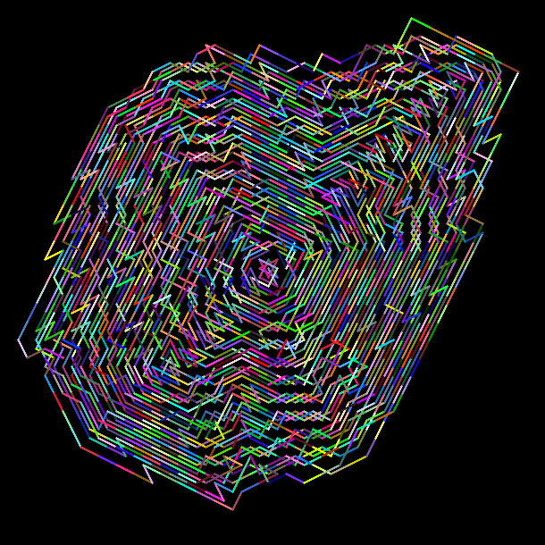
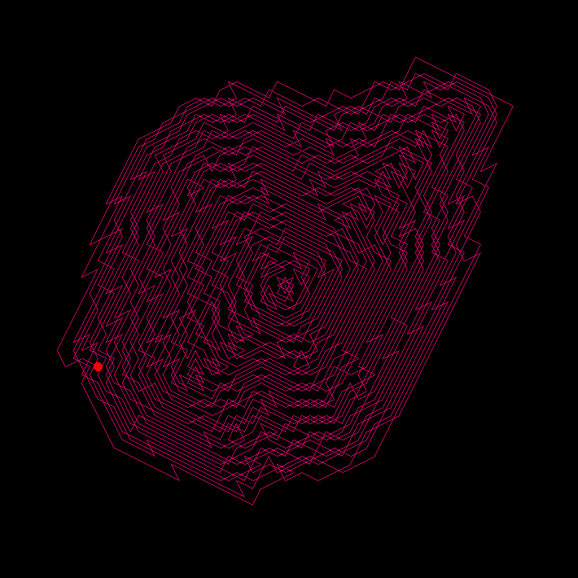
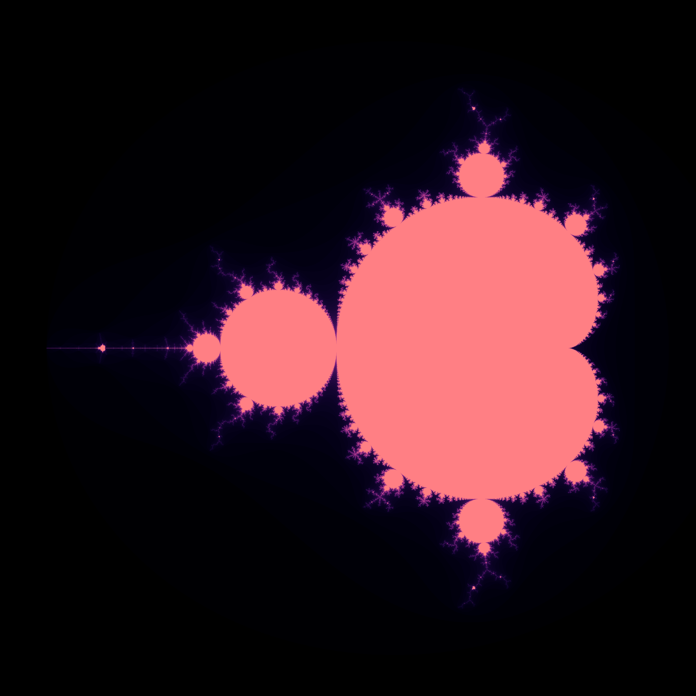
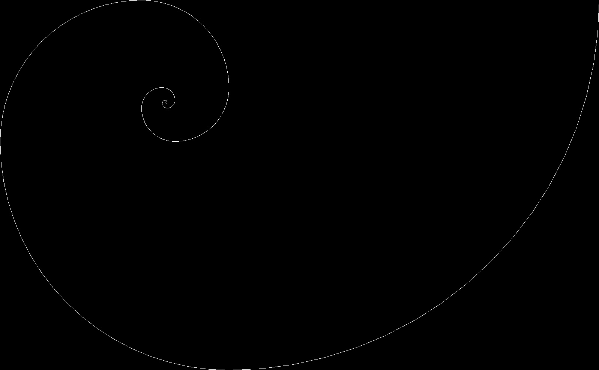
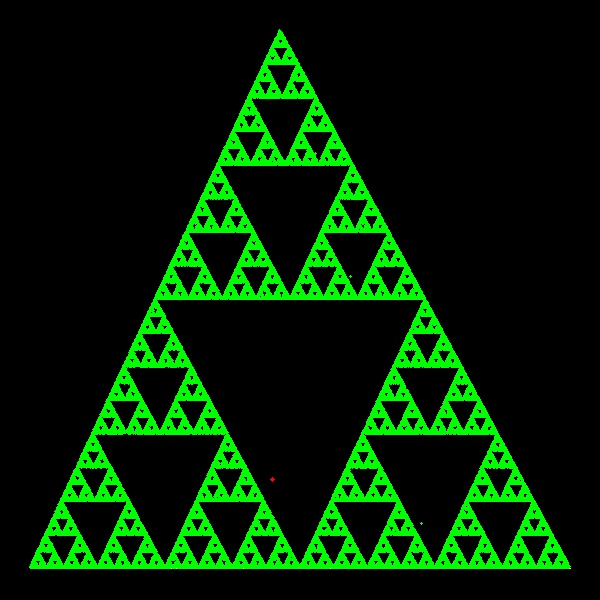

#### Some math drawings using Python

## About  
Drawings of the Dragon Curve, Trapped Knight, Mandelbrot Set, and Fibonacci Spiral done in Python using mostly the OpenCV library.  
Inside each folder you'll find all the images I have produced, as well as the source code to generate them yourself.  

(Beware, it might be configured only to generate the last one or something like that, surely have fun playing tweaking it!)

Only for fun purposes.  

### Dragon Curve  
Read about this fractal [here](https://en.wikipedia.org/wiki/Dragon_curve) or watch [this Numberphile video](https://www.youtube.com/watch?v=wCyC-K_PnRY). Evidently my favourite and my profile picture for several websites including GitHub.

 
 

### Trapped Knight
Learn more about this drawing on [this](https://www.youtube.com/watch?v=RGQe8waGJ4w) video featuring Neil Sloane.  

 
 

### Mandelbrot Set
Learn (a very little bit) about this mind-baffling structure [here](https://en.wikipedia.org/wiki/Mandelbrot_set).

### Fibonacci Spiral
The simplest of them all, a traditional Fibonacci Spiral.

### Sierpinski Triangle constructed by chaos
I have to clean the code for this one. You'll have to wait.

Meanwhile watch [this](https://study.com/academy/lesson/the-sierpinski-triangle-the-chaos-game.html), perhaps. It's very interesting.

